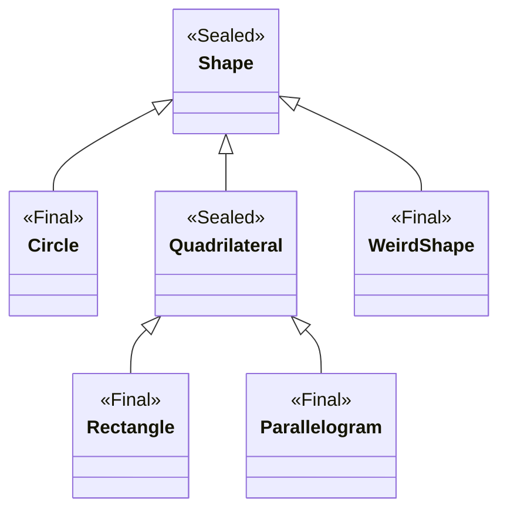

# Java 9 到 17 的语言特性更新

> 本译文已获取作者许可后翻译、调整、发布。
>
> 原文：[New language features since Java 8 to 17（Enhancements to the Java language you should know）](https://advancedweb.hu/new-language-features-since-java-8)
>
> 此外，Oracle 官方也有清单可供一览：[Java Language Changes](https://docs.oracle.com/en/java/javase/17/language/java-language-changes.html#GUID-6459681C-6881-45D8-B0DB-395D1BD6DB9B)

当 Java 8 引入流和 Lambda 这两个重大更新时，函数式编程风格赋予了 Java 更少模板代码的语法。虽然最近的版本更新没添加这么富有影响的特性，但带来了很多较小的改进。自从 Java 切换到一个更快的发布节奏后，每六个月就会发布一个新版本。记录类可能是最近更新中最重要的一个特性，模式匹配和封闭类也会让处理纯数据更容易。


## 目录

**Java 17** (LTS)

- [封闭类](#封闭类)
- [switch 模式匹配（预览特性🔍）](#switch-模式匹配（预览特性🔍）)

**Java 16**

- [记录类](#记录类)
- [instanceof 模式匹配](#instanceof-模式匹配)

**Java 15**

- [文本块](#文本块)
- [包含有用信息的空指针异常](#包含有用信息的空指针异常)

**Java 14**

- [Switch 表达式](#switch-表达式)

**Java 11** (LTS)

- [局部变量类型推断](#局部变量类型推断)

**Java 9**

- [接口中允许私有方法](#接口中允许私有方法)
- [匿名内部类的钻石操作符](#匿名内部类的钻石操作符)
- [try-with-resources 语句中允许使用 effectively-final 变量](#try-with-resources-语句中允许使用-effectively-final-变量)
- [下划线不再是合法变量名](#下划线不再是合法变量名)
- [改进的警告](#改进的警告)

想要一览塑造这个新平台所有的 JEP[^1]，其涵盖了包括 API 、性能与安全方面的改进，参看这份[精选清单：Java 8 以来所有的改进](https://advancedweb.hu/a-categorized-list-of-all-java-and-jvm-features-since-jdk-8-to-15/)[^2]。


## 封闭类

**开始支持版本：** [`JDK 17`](https://openjdk.java.net/jeps/409) ( [`JDK 15`](https://openjdk.java.net/jeps/360)  [`JDK 16`](https://openjdk.java.net/jeps/397) 为预览特性)

封闭类用于限定哪些类或接口可以被用于继承或实现它们。这给设计公共 API 和替换枚举来构建固定数量的可选项，提供了一个更好的工具。

老版本的 Java 也提供了一些机制来实现类似的效果。标记为 `final` 的类不允许被继承，配合访问修饰符就能确保仅同一包中的类才能继承。

在此之上，*封闭类*提供了更细粒度的控制，让开发者能显式地列举其子类。

```java
public sealed class Shape
    permits Circle, Quadrilateral {...}
```

在这个例子中，被允许继承 `Shape` 类的只有 `Circle` 和 `Quadrilateral` 类。实际上，*permits* 这个关键字有些歧义，因为它不止有允许的含义，其**要求列举的类直接继承封闭类**。

此外，正如人们所期望的那样，如果**任何其它的类试图继承这个封闭类，都会出现编译错误**。

继承封闭类的类需要符合一些规则。

**开发者被强制每次都需要显式定义出封闭类继承的边界**，通过添加任意一个下面修饰符到被允许的子类上来实现：

- `final`: 子类不能继承
- `sealed`: 子类仅能继承被允许的类
- `non-sealed`: 子类能任意继承

因为子类本身也可以是封闭的，这就意味着可以定义**整条继承链包含限定的可选项**：

```java
public sealed class Shape
    permits Circle, Quadrilateral, WeirdShape {...}

public final class Circle extends Shape {...}

public sealed class Quadrilateral extends Shape
    permits Rectangle, Parallelogram {...}
public final class Rectangle extends Quadrilateral {...}
public final class Parallelogram extends Quadrilateral {...}

public non-sealed class WeirdShape extends Shape {...}
```



如果这些类比较简短，且大多仅和数据相关，那么可以将它们声明在**同一个源文件中，`permits` 关键字也可以忽略**：

```java
public sealed class Shape {
  public final class Circle extends Shape {}

  public sealed class Quadrilateral extends Shape {
    public final class Rectangle extends Quadrilateral {}
    public final class Parallelogram extends Quadrilateral {}
  }

  public non-sealed class WeirdShape extends Shape {}
}
```

记录类也可以作为封闭类的子类，因为它们是隐式 final 的。

**被允许继承的类必须和父类（封闭类）在同一个包里**，如果是使用 java 模块，那它们必须在同一模块中。

### ⚠️技巧：考虑使用封闭类优于枚举

在*封闭类*出现前，只能用*枚举类*对固定可选项建模，比如：

```java
enum Expression {
  ADDITION,
  SUBTRACTION,
  MULTIPLICATION,
  DIVISION
}
```

然而，所有的变量都要在同一个源文件中，且*枚举类*不支持需要实例的情况（而不是常量），例如表示一个类型的单个消息。

*封闭类*提供一个比*枚举类*更好的选择，使得用普通类来为固定可选项建模成为可能。当 *switch 模式匹配*在生产环境可用时就更能充分发挥其作用，*封闭类*能像枚举一样在 `switch` 表达式中使用，编译器能自动检查代码是否涵盖了全部情况。

枚举类的值可以使用 `values` 方法列举出来。对应到封闭类和封闭接口，可以使用 `getPermittedSubclasses` 方法例举出所有被允许继承的子类。


## switch 模式匹配（预览特性🔍）

**开始支持版本：**[`JDK 17`](https://openjdk.java.net/jeps/406) 为预览特性

此前，`switch` 表达式的用法十分局限：条件仅仅支持完全相等的情况，而且只支持很少几类类型：数值、枚举类和字符串。

这个预览特性增强了 `swith` 表达式的用法，**可以用在任意的类型上，匹配更复杂的模式**。

这些新特性是**向后兼容的**，`switch` 搭配传统的常量就如以往一样的使用，例如和枚举值：

```java
var symbol = switch (expression) {
  case ADDITION       -> "+";
  case SUBTRACTION    -> "-";
  case MULTIPLICATION -> "*";
  case DIVISION       -> "/";
};
```

然而，随着 [JEP 394: Pattern Matching for instanceof](https://openjdk.java.net/jeps/394) 的引入，现在可以和类型模式搭配使用：

```java
return switch (expression) {
  case Addition expr       -> "+";
  case Subtraction expr    -> "-";
  case Multiplication expr -> "*";
  case Division expr       -> "/";
};
```

模式还支持**卫语句**[^3]，写法为`type pattern && guard expression`：

```java
String formatted = switch (o) {
    case Integer i && i > 10 -> String.format("a large Integer %d", i);
    case Integer i           -> String.format("a small Integer %d", i);
    default                  -> "something else";
};
```

这和使用 `if` 声明的类型模式构成了很好的对称性，因为类似的模式可以用于条件语句：

```java
if (o instanceof Integer i && i > 10) {
  return String.format("a large Integer %d", i);
} else if (o instanceof Integer i) {
  return String.format("a large Integer %d", i);
} else {
  return "something else";
}
```

与 `if` 条件类似，**模式变量的作用域是分支敏感的**（flow sensitive）。比如，在下面的条件中，变量 `i` 的作用域为卫语句及其右边的表达式。

```java
case Integer i && i > 10 -> String.format("a large Integer %d", i);
```

总体来说，模式匹配会按你期待的那样工作，但其中涉及了很多规则和边缘情况。如果你感兴趣，我推荐你读下相关的 JEPs 或是看下  [Pattern matching for instanceof](#instanceof-模式匹配)  章节。

**Switch 现在也能匹配 `null` 值**。通常来说，当 `null` 值传给 `switch` 会报 `NullPointerException`。当一个常量试图匹配 `null` 的时候也会出现这种情况。然而，现在可以显示得声明 `null` 在分支上：

```java
switch (s) {
  case null  -> System.out.println("Null");
  case "Foo" -> System.out.println("Foo");
  default    -> System.out.println("Something else");
}
```

**当 `switch` 表达式没有完全覆盖各种情况分支，或是一个分支条件完全包含了另一个分支，编译器会报错。**

```java
Object o = 1234;

// OK
String formatted = switch (o) {
    case Integer i && i > 10 -> String.format("a large Integer %d", i);
    case Integer i           -> String.format("a small Integer %d", i);
    default                  -> "something else";
};

// 编译错误 - 'switch' 表达式没有涵盖所有可能的输入值
String formatted = switch (o) {
    case Integer i && i > 10 -> String.format("a large Integer %d", i);
    case Integer i           -> String.format("a small Integer %d", i);
};

// 编译错误 - 第二个条件已包含在第一个条件分支中
String formatted = switch (o) {
    case Integer i           -> String.format("a small Integer %d", i);
    case Integer i && i > 10 -> String.format("a large Integer %d", i);
    default                  -> "something else";
};
```

这个**预览**特性需要通过 `--enable-preview` 标记来显式开启。当然我们试目以待吧，因为更多的特性将要到来：[JEP405](https://openjdk.java.net/jeps/405) 针对 Java 18 ，旨在带来可用于解构的数组模式和记录类模式。


## 记录类

**开始支持版本：** [`JDK 16`](https://openjdk.java.net/jeps/394) ( [`JDK 14`](https://openjdk.java.net/jeps/305)  [`JDK 15`](https://openjdk.java.net/jeps/375) 为预览特性)

记录类给 Java 语言带来了一种「新的」类型声明，通过简短的语法来创建数据类（data classes）。相较于传统的私有成员变量、getter 和 setter 方法以及构造方法来构建，记录类可以让我们使用一种**简短的语法**来定义：

```java
public record Point(int x, int y) { }
```

上面的记录类很像普通的类，其有以下定义：

- 两个私有的、final 的成员变量：int x 和 int y
- 一个以 x 和 y 作为参数的构造方法
- 成员变量的 getter 方法：x() 和 y() 
- 涉及 x 和 y 变量的 hashCode、equals 和 toString 方法

它们使用起来也很像一般的类：

```java
var point = new Point(1, 2);
point.x(); // 返回 1
point.y(); // 返回 2
```

记录类旨于作为**浅层不可变数据**（shallowly immutable data）的**透明载体**（transparent carriers）。为支撑这种设计，随之而来的是一系列**限制**。

记录类不仅仅成员变量默认是 final 的，甚至**不允许有非 final 的成员变量**。

**记录类头部必须定义出所有可能的状态**。其主体不能定义额外的成员变量。再者，虽然可以定义额外的构造方法来提供一些成员变量的默认值，但无法隐藏含有所有成员变量的*标准构造方法*（*canonical constructor*）[^4]。

最后，记录类**不能继承其它类**，**不能声明 native 方法**，是**隐式 final 的**，也**不能是抽象的**。

因为它的成员变量不可变，给其*填充数据*也只能通过构造方法。

默认一个记录类仅有一个隐式的*标准构造方法*。如果数据需要校验或标准化（normalized），*标准构造方法*也能被显式声明：

```java
public record Point(int x, int y) {
  public Point {
    if (x < 0) {
      throw new IllegalArgumentException("x can't be negative");
    }
    if (y < 0) {
      y = 0;
    }
  }
}
```

编译器自动添加的隐式*标准构造方法*和记录类本身具有相同的可见性。如果是显式声明的，它的访问修饰符必须至少和记录类的访问修饰符具有一样权限。

记录类也可以自定义额外的构造方法，但是必须委派给其它的构造方法。因为最后*标准构造方法*始终会被调用。额外的构造方法对于设置默认值很有用。

```java
public record Point(int x, int y) {
  public Point(int x) {
    this(x, 0);
  }
}
```

从记录类*获取数据*是通过它的访问器方法。对于每个成员变量，例如 x，记录类都会生成对应的公共 getter 方法，像 x() 这种格式。

这些 getter 方法也可以显式声明：

```java
public record Point(int x, int y) {
  @Override
  public int x() {
    return x;
  }
}
```

注意上面的例子， Override 注解能被用于确保显式定义的方法是一个访问器方法，而不是意外地添加成其它普通方法。

除了 getter 方法，hashCode、equals 以及 toString 方法都有默认提供，且涉及所有成员变量；当然这些方法也可以显式声明。

最后，记录类也允许有静态方法和实例方法，用于方便地得到衍生信息或是作为工厂方法：

```java
public record Point(int x, int y) {
  static Point zero() {
    return new Point(0, 0);
  }
  
  boolean isZero() {
    return x == 0 && y == 0;
  }
}
```

小结一下：**记录类专注于承载数据**，不提供太多定制化选项。

得益于这样的特殊设计，**记录类的序列化也十分容易**且安全，相较于[其它的普通类](http://cr.openjdk.java.net/~briangoetz/amber/serialization.html)来说。就像 JEP 中提及的：

> 记录类的实例能被序列化和反序列化。然而不能通过提供 writeObject，readObject，readObjectNoData，writeExternal 或 readExternal 方法来自定义其处理流程。记录类的组件（成员变量）负责序列化，而记录类的标准构造方法掌管反序列化。

由于序列化正好基于成员变量的状态，反序列化又总会调用标准构造方法，所以不可能创建一个无效状态的记录类。

从用户（开发者）的角度来看，开启和使用序列化和以往一样：

```java
public record Point(int x, int y) implements Serializable { }

public static void recordSerializationExample() throws Exception {
  Point point = new Point(1, 2);

  // 序列化
  ObjectOutputStream oos =
    new ObjectOutputStream(new FileOutputStream("tmp"));
  oos.writeObject(point);

  // 反序列化
  ObjectInputStream ois =
    new ObjectInputStream(new FileInputStream("tmp"));
  Point deserialized = (Point) ois.readObject();
}
```

注意这里不再需要定义 serialVersionUID 了，因为记录类抛弃了对 serialVersionUID 比对的要求。

参考来源[^5]：

- [Inside Java Podcast Episode 4: “Record Classes” with Gavin Bierman](https://inside.java/2020/10/05/podcast-004/)
- [Inside Java Podcast Episode 14: “Records Serialization” with Julia Boes and Chris Hegarty](https://inside.java/2021/03/08/podcast-014/)
- [Towards Better Serialization - Brian Goetz, June 2019](http://cr.openjdk.java.net/~briangoetz/amber/serialization.html)
- [Record Serialization](https://docs.oracle.com/en/java/javase/16/docs/specs/records-serialization.html)

### ⚠️ 技巧：使用本地记录类来构建中间转化变量

复杂的数据转换需要我们构建中间变量。在 Java 16 之前，典型方案是依赖于 Pair 或三方库里相似的 holder 类，再或者是自己定义（可能是静态内部）类来承载数据。

这样做的问题是，前者通常被证实不够灵活，后者又在仅用于单个方法的上下文中引入了其它类，污染了命名空间。虽然也可以在方法体中定义类，但也因为其啰嗦的语法很少这么用。

Java 16 改进了这点，现在也可以**在方法体中定义本地记录类**：

```java
public List<Product> findProductsWithMostSaving(List<Product> products) {
  record ProductWithSaving(Product product, double savingInEur) {}

  products.stream()
    .map(p -> new ProductWithSaving(p, p.basePriceInEur * p.discountPercentage))
    .sorted((p1, p2) -> Double.compare(p2.savingInEur, p1.savingInEur))
    .map(ProductWithSaving::product)
    .limit(5)
    .collect(Collectors.toList());
}
```

记录类紧凑的语法正好契合 Steam API 紧凑的语法。

除了记录类外，这个改进也适用于本地枚举甚至接口。

### ⚠️ 技巧：检查你用的类库

**记录类没有遵循 [JavaBeans](https://www.oracle.com/java/technologies/javase/javabeans-spec.html) 的约定**：

- 没有默认的构造方法；
- 没有 setter 方法；
- 访问器方法不依照 getX() 格式；

由于以上原因，**一些依循 JavaBeans 约定的工具类和记录类可能不能正常使用**。

举个例子，**记录类不能用作 JPA（比如 Hibernate ）的实体**。有一些[关于 JPA 遵循记录类规范的讨论](https://www.eclipse.org/lists/jpa-dev/msg00056.html)，但迄今为止我没找到相关开发进度的报道。然而值得一提的是，有文章指出[将记录类能应用到项目中](https://thorben-janssen.com/java-records-hibernate-jpa/)且没有问题。

大多数我[试过的工具类](https://advancedweb.hu/working-with-structured-data-in-java/)（包括 [Jackson](https://github.com/FasterXML/jackson)，[Apache Commons Lang](https://commons.apache.org/proper/commons-lang/)，[JSON-P](https://javaee.github.io/jsonp/)，[Guava](https://github.com/google/guava) ）都**支持记录类，但由于它十分新还存在些小问题**。

比如，流行的 JSON 库 Jackson [较早就支持记录类](https://github.com/FasterXML/jackson-future-ideas/issues/46)。它的大多数特性，包括对记录类和 JavaBeans 的序列化、反序列化都没什么问题，但[操控对象的特性还没适配](https://github.com/FasterXML/jackson-databind/issues/3079)。

我的建议是，**在使用记录类前先升级并检查使用的工具库**，避免意外之喜，但大体上来说，可以认为流行的工具库已经涵盖了大部分特性。

参看我在 [Github 上关于记录类的工具库集成试验](https://github.com/dodie/java-tutorials/tree/master/working-with-structured-data)。


## instanceof 模式匹配

**开始支持版本：** [`JDK 16`](https://openjdk.java.net/jeps/394) ( [`JDK 14`](https://openjdk.java.net/jeps/305)  [`JDK 15`](https://openjdk.java.net/jeps/375) 为预览特性)

大多数情况下，`instanceof` 都会跟一个显式的类型转换：

```java
if (obj instanceof String) {
    String s = (String) obj;
    // 使用变量 s
}
```

至少以前是这样，好在 Java 16 扩展了 `instanceof` 关键字，使其在使用时不再那么啰嗦：

```java
if (obj instanceof String s) {
    // 使用变量 s
}
```

这种模式匹配其实是一种*检测*（obj instance of）和*模式变量*（s）的组合。

这种*检测***和旧的 instanceof 操作符几乎一样**，除了若不保证它能通过的话，会导致编译错误。

```java
// 老的 instanceof 操作符，没有模式变量：
// 编译时这个条件一直是 true
Integer i = 1;
if (i instanceof Object) { ... } // 没问题

// 新的 instanceof 操作符，有模式变量：
// 在这种情形会产生编译错误
if (i instanceof Object o) { ... } // 报错
```

注意，相反即使用的是旧的 instanceof 操作符，出现了编译错误，那么模式匹配也总会失败。

而且仅在检测通过时，*模式变量*才会从目标变量中提取出来。**它几乎和常规的非 final 变量一样**：

- 值能被修改
- 可以跟在成员变量声明的后面
- 如果和本地变量重名，将会导致编译错误

然而，模式变量有着特殊的作用域规则：该作用域是明确匹配的，并由流程控制的作用域解析决定。

从上面例子里可以看出最简单的情形：如果检测通过，变量 s 能在 if 语块中使用。

但「明确匹配」的规则也能应用到更复杂的情形：

```java
if (obj instanceof String s && s.length() > 5) {
  // 使用变量 s
}
```

变量 s 能被用于判断条件的第二部分是因为，仅在第一部分的 instanceof 操作符匹配成功时，它才会被赋值。

再来个更细节的例子，提前返回值和异常也能确保匹配：

```java
private static int getLength(Object obj) {
  if (!(obj instanceof String s)) {
    throw new IllegalArgumentException();
  }

  // 变量 s 在作用域中 - 如果 instanceof 没能匹配成功
  //      则不会执行到这个声明
  return s.length();
}
```

流程控制的作用域解析和现有的流程解析很相似，比如对[明确赋值](https://docs.oracle.com/javase/specs/jls/se15/html/jls-16.html)的检测：

```java
private static int getDoubleLength(String s) {
  int a; // 变量 a 声明了但未赋值
  if (s == null) {
    return 0; // 提前返回
  } else {
    a = s.length(); // 赋值变量 a
  }

  // 变量 a 已经是明确赋值的
  // 所以我们可以使用它
  a = a * 2;
  return a;
}
```

我十分喜欢这个特性，因为它对减少 Java 程序中显式类型转换造成非必要代码膨胀很会有帮助。相较于其它现代编程语言，仍显得有那么一点点啰嗦。

比如在 Kotlin 中你根本不需要定义模式变量：

```kotlin
if (obj is String) {
    print(obj.length)
}
```

至于 Java 的模式变量，是确保向后兼容性的手段。因为改变 obj instanceof String 中 obj 的类型也就意味着，在其被用作重载方法参数的时候，调用可能会被解析成这个方法的不同版本。

### ⚠️ 技巧：敬请关注更新

模式匹配在当下看来可能没什么大不了的，但很快会有更多有意思的特性发布。

[JEP 405](https://openjdk.java.net/jeps/405) 提议新增一个解构的特性，来支持其能用于记录类或数组：

```java
if (o instanceof Point(int x, int y)) {
  System.out.println(x + y);
}

if (o instanceof String[] { String s1, String s2, ... }){
  System.out.println("The first two elements of this array are: " + s1 + ", " + s2);
}
```

接下来，[JEP 406](https://openjdk.java.net/jeps/406) 准备将模式匹配带到 switch 表达式和语句中：

```java
return switch (o) {
  case Integer i -> String.format("int %d", i);
  case Long l    -> String.format("long %d", l);
  case Double d  -> String.format("double %f", d);
  case String s  -> String.format("String %s", s);
  default        -> o.toString();
};
```

现在这两个提议都还在备选状态，未明确其具体搭载的版本号，希望能尽早看到其预览版本发布。


## 文本块

**开始支持版本：** [`JDK 15`](https://openjdk.java.net/jeps/378) ( [`JDK 13`](https://openjdk.java.net/jeps/355)  [`JDK 14`](https://openjdk.java.net/jeps/368) 为预览特性)

相较于其它现代编程语言，在 Java 中编写多行字符串是臭名昭著的麻烦：

```java
String html = "";
html += "<html>\n";
html += "  <body>\n";
html += "    <p>Hello, world</p>\n";
html += "  </body>\n";
html += "</html>\n";

System.out.println(html);
```

为改进这种情况，更加利好程序员，Java 15 引入了多行字符串字面量，叫做文本块：

```java
String html = """
          <html>
            <body>
              <p>Hello, world</p>
            </body>
          </html>
          """;

System.out.println(html);
```

它们和之前旧的字符串字面量相似，但它们**换行和引号都不需要转义**。

文本块开始于 `"""`，后面紧跟换行，最后也以 `"""` 结尾。结尾标记可以放在最后一行，也可以像上面的例子新起一行。

它们可以用在任何之前旧的字符串字面量能使用的地方，都同样产生 String 对象。

源代码中的每个换行的地方都会产生一个 `\n` 字符。

```java
String twoLines = """
          Hello
          World
          """;
```

这样可以避免每行以 `\` 字符结尾，对于那些太长以至于不得不换行的字符串来说，保持其代码可读性十分有帮助。

```java
String singleLine = """
          Hello \
          World
          """;
```

文本段可以和相邻的 Java 代码对齐，因为**意外的缩进会被自动移除**。编译器会检查每行用于缩进的空格，找到缩进最少的行，然后将每行都转化为这个相同的最少缩进。

这就意味着如果结尾的 `"""` 是在一个单独的行，转变结尾标记到左边会导致缩进增加。

```java
String noIndentation = """
          First line
          Second line
          """;

String indentedByToSpaces = """
          First line 
          Second line
        """;
```

开头的 `"""` 不会影响缩进移除，所以文本块没有必要和其对齐。例如，下面的例子将产生相同的缩进：

```java
String indentedByToSpaces = """
         First line 
         Second line
       """;

String indentedByToSpaces = """
                              First line 
                              Second line
                            """;
```

`String` 类通用也可以通过编程式的方法来处理缩进。`indent` 方法接收一个整数作为入参，相应的返回一个新的，特定缩进级别的字符串；与之对应的，`stripIndent` 方法返回一个移除源内容所有缩进的字符串。

文本块不支持插值，这个功能我十分期待。JEP 表示在未来的版本中会考虑，但到那之前，我们可以使用 `String::formatted` 或 `String::format`：

```java
var greeting = """
    hello
    %s
    """.formatted("world");
```

参考来源[^5]：

- [Programmer’s Guide To Text Blocks](https://cr.openjdk.java.net/~jlaskey/Strings/TextBlocksGuide_v11.html)
- [Definitive Guide To Text Blocks In Java 13](https://nipafx.dev/java-13-text-blocks#)
- [Java Text Blocks - Bealdung](https://www.baeldung.com/java-text-blocks)

### ⚠️ 技巧：保留结尾空格

在文本块的结尾空格会被忽略掉。这通常不是问题，除非在特定的场景，比如在单元测试时一个方法的执行结果需要和一个基准值做比较。

如果是需要考虑这些的场景时，这行结尾需要添加 `\s` 或 `\t`，而不是空格或者是制表符。

### ⚠️ 技巧：正确处理 Windows 的换行符

[换行](https://en.wikipedia.org/wiki/Newline)在 Unix 和 Windows 下有着不同的控制符。前者使用单一的换行符（`\n`），而后者多使用了回车符（`\r\n`）。

然后不论你是用什么操作系统，或者在源码中使用什么换行符，文本块都会使用单一的 `\n` 来换行，这可能会导致兼容性问题。

```java
Files.writeString(Paths.get("<PATH_TO_FILE>"), """
    first line
    second line
    """);
```

如果使用一个仅兼容 Windows 换行符的软件（如 Notepad）打开这样的文件，会单单只显示一行。如果你旨在兼容 Windows 系统，请确保使用正确的换行符，比方说使用 `Stirng::replace` 来替换每一个 `"\n"` 字符为 `"\r\n"`。

### ⚠️ 技巧：关注缩进的一致性

文本块在任意类型的缩进下都能胜任：制表符、空格或者两者混用。但每行使用一致的缩进很重要，否则意外的缩进不会被移除。

大多数文本编辑器都提供了自动格式化，且在你敲击回车键时会自动添加缩进。使用最新版本的编辑器来确保它们能正确处理文本块，还有就是避免使用错误的缩进。


## 包含有用信息的空指针异常

**开始支持版本：**[`JDK 15`](https://bugs.openjdk.java.net/browse/JDK-8233014) ([`JDK 14`](https://openjdk.java.net/jeps/358) 中使用 `-XX:+ShowCodeDetailsInExceptionMessages` 开启)

这个特性不能算做真正意义的语言特性，但它很棒以至于我想将它加到这份清单中。

一般来说，遇到一个 `NullPointerException` 是这样的：

```java
node.getElementsByTagName("name").item(0).getChildNodes().item(0).getNodeValue();

Exception in thread "main" java.lang.NullPointerException
        at Unlucky.method(Unlucky.java:83)
```

这个例子中，异常信息中很难看出是哪个方法返回了空。因此很多开发者常常将这样的语句改写为多行，来排查到底是哪一行代码导致了空指针异常。

从 Java 15 开始，再也没必要这样做了，NPE 会描述出这条语句的哪个部分为空。（在 Java 14 中你也可以通过 `-XX:+ShowCodeDetailsInExceptionMessages` 标记来开启这个特性）

```
Exception in thread "main" java.lang.NullPointerException:
  Cannot invoke "org.w3c.dom.Node.getChildNodes()" because
  the return value of "org.w3c.dom.NodeList.item(int)" is null
        at Unlucky.method(Unlucky.java:83)
```

（[参看 Github 上这个示例项目](https://github.com/dodie/java-tutorials/tree/master/java-helpful-npe-demo)）

详细的信息包含了不能被执行的步骤（无法调用 `getChildNodes`），及其失败原因（`item(int)` 为空），这大大简化了定位问题根源。

总体上来说，**这个特性有助于调试，同样也对代码可读性有提升**，从此你又失去了一个牺牲代码可读性的技术原因。

有用信息的空指针异常扩展是在 JVM 层面实现的，这也就是说，即使你的代码编译为较老的 Java 版本也同样能受益，而且当你使用其它 JVM 语言，例如 Scala 或 Kotlin 也一样。

值得注意的是，**并非所有的空指针异常都能得到这些额外的信息，仅仅是被 JVM 创建并抛出的才行**：

- 读取或写入一个成员变量为空时
- 调用一个方法为空时
- 获取或赋值一个数组元素为空时（索引信息**不在**错误信息中）
- [包装类开箱](https://docs.oracle.com/javase/tutorial/java/data/autoboxing.html) 为空时

另外值得注意的是，这个特性**不支持序列化**。比如，当一个空指针异常被通过 RMI 方式的远程调用，异常信息里不会包含有用信息。

当前**有用信息的空指针这一特性默认关闭**，必须加上 `-XX:+ShowCodeDetailsInExceptionMessages` 标记来手动开启。

### ⚠️ 技巧：检查你的工具链

当你升级到 Java 15 时，检查你的应用和基础设施并确保以下几点：

- 大小写敏感到变量命名不会出现在日志文件和网页服务器响应中
- 日志分析工具能处理新的消息格式
- 构建额外细节的额外开销是有必要的


## Switch 表达式

**开始支持版本：** [`JDK 14`](https://openjdk.java.net/jeps/361) ([`JDK 12`](https://openjdk.java.net/jeps/325) [`JDK 13`](https://openjdk.java.net/jeps/354) 中为预览特性)

久远的 `switch` 关键字在 Java 14 中获得了一次大提升。Java 在保持支持久的 [switch 语句](https://docs.oracle.com/javase/tutorial/java/nutsandbolts/switch.html) 功能特性的同时，也添加了 **swith 表达式**[^6]的语法支持：

```java
int numLetters = switch (day) {
    case MONDAY, FRIDAY, SUNDAY -> 6;
    case TUESDAY                -> 7;
    default      -> {
        String s = day.toString();
        int result = s.length();
        yield result;
    }
};
```

最重大的差别是，这个新的语法形式**能作为表达式使用**。从上面的例子中可见，这可用于变量赋值，且可以用在任何接受表达式的地方：

```java
int k = 3;
System.out.println(
    switch (k) {
        case  1 -> "one";
        case  2 -> "two";
        default -> "many";
    }
);
```

然而，switch 表达式和 switch 语句之间存在一些细微的差别。

首先，switch 表达式**不存在击穿（fall-through）的情况**。这样再也不会因缺失 `break` 关键字而产生缺陷了。为了避免有使用击穿的需求，**每个 `case` 可以定义多个常量**，以逗号分割。

其次，每一个 `case` **有其自己的作用域**。

```java
String s = switch (k) {
    case  1 -> {
        String temp = "one";
        yield temp;
    }
    case  2 -> {
        String temp = "two";
        yield temp;
    }
    default -> "many";
}
```

每个分支要么是一条单独的表达式，要么是由包裹在一个语块中的多条语句组成。

再者，**switch 表达式必须涵盖所有的分支条件**。这就意味着对于字符串类型、基本类型以及它们的包装类来说，`default` 的情况必须指明。

```java
int k = 3;
String s = switch (k) {
    case  1 -> "one";
    case  2 -> "two";
    default -> "many";
}
```

对于枚举的话，要么 `defualt` 需要声明，要么显式的声明出所有情况。后者的话是最佳实践，能确保所有的值都被考虑到了。当给枚举中添加一个新值时，用到它作为 switch 表达式的地方都会报出编译错误。

```java
enum Day {
   MONDAY, TUESDAY, WEDNESDAY, THURSDAY, FRIDAY, SATURDAY, SUNDAY
}

Day day = Day.TUESDAY;
switch (day) {
    case  MONDAY -> ":(";
    case  TUESDAY, WEDNESDAY, THURSDAY -> ":|";
    case  FRIDAY -> ":)";
    case  SATURDAY, SUNDAY -> ":D";
}
```

鉴于以上所有原因，更偏向于使用 switch 表达式而不是 switch 语句，能利于产出更多可维护的代码。

### ⚠️ 技巧：使用箭头语法

switch 表达式中 `case` 不仅能使用类似于 lambda 表达式中箭头形式，还能配合 `yeild` 关键字**使用类似于以往 switch 语句中的冒号形式**：

```java
int result = switch (s) {
    case "foo":
    case "bar":
        yield 2;
    default:
        yield 3;
};
```

这种形式也能被用作一个表达式，但这更类似于以往的 switch 语句，因为：

- 击穿
- 所有分支共享一个作用域

我的意见？不要使用这种形式，而是使用箭头形式的 switch 表达式，这样能获取所有好处。


## 局部变量类型推断

**开始支持版本：** [`JDK 11`](https://openjdk.java.net/jeps/323) ([`JDK 10`](https://openjdk.java.net/jeps/286) Lambda 中不支持)

自从 Java 8 之后最显著的语言特性改进可能是 `var` 关键字。这最初是在 [Java 10](https://openjdk.java.net/jeps/286) 中引入的，随后在 [Java 11](https://openjdk.java.net/jeps/323) 中得到进一步改进。

通过省略显式的类型声明，这个特性帮助我们简化了局部变量声明的繁文缛节：

```java
var greetingMessage = "Hello!";
```

虽然看起来像 Javascript 中的 `var` 关键字，但这**并非是动态类型**。

来看下这段来自 JEP 的引述：

> 我们旨在简化 Java 代码编写中的繁文缛节，来提升开发者的编程体验，并保持 Java 作为静态类型安全语言的承诺。

声明变量的类型是**在编译时推断的**。在上面的例子中其类型是字符串。使用 `var` 而不是显式的类型，能使这块代码不那么臃肿，也更易读。

这是另一个类型推断能发挥优势的例子：

```java
MyAwesomeClass awesome = new MyAwesomeClass();
```

在很多的情况下，这个特性确实能提升代码质量。但有时候继续使用显式的类型声明反而是更推崇的。我们来看几个使用 `var` 替换类型声明导致问题的例子。

### ⚠️ 技巧：时刻考虑可读性

第一个情形是，当在源码中移除显式的类型信息，会影响可读性。

当然，IDE 能在这方面起到一定帮助，但是在代码评审，或快速浏览代码时这就会有影响。例如，在工厂模式或构造者模式中，你不得不找到负责构建对象的代码，才能推断出其类型。

来点小测试，下面的代码片段使用了 Java 8 中的日期时间 API，猜下这些变量的类型：

```java
var date = LocalDate.parse("2019-08-13");
var dayOfWeek = date.getDayOfWeek();
var dayOfMonth = date.getDayOfMonth();
```

猜完了吗？这是答案：

第一个变量十分直观，`parse` 方法返回了 `LocalDate` 对象。然而，接下来两个，你需要对 API 更了解： `dayOfWeek` 方法返回的是 `java.time.DayOfWeek`，但 `dayOfMonth` 仅仅是返回了 `int`。

还有个潜在问题，遇到 `var` 时，代码阅读者不得不更依赖于上下文。想象下这个例子：

```java
private void longerMethod() {
    // ...
    // ...
    // ...

    var dayOfWeek = date.getDayOfWeek();

    // ...
    // ...
    // ...
}
```

基于之前对例子，你可能会猜是 `java.time.DayOfWeek` 。但这个例子中的 `date` 对象是 Joda 库中的，所以返回的是整型。这是个不同的 API，同样的方法但有所差池，在较长的方法体中，若没看完每行代码，会导致你看不出差异。(JavaDoc: [Joda time](https://www.joda.org/joda-time/apidocs/org/joda/time/ReadableDateTime.html#getDayOfWeek--) / [Java 8 Date/Time API](https://docs.oracle.com/javase/8/docs/api/java/time/LocalDate.html#getDayOfWeek--))

如果这儿有显式的类型声明，弄清 `dayOfWeek` 对象是什么类型就很容易。现在有了 `var` ，读者首先得找出 `date` 对象的类型，还要搞清 `getDayOfWeek` 方法做了什么。要是有一个 IDE，这一切都很轻松，但是仅仅是快速浏览代码，这就没那么容易了。

### ⚠️ 技巧：注意保留重要的类型信息

第二个情形是，使用 `var` 消除了所有可用的类型信息，甚至导致无法被推断。在绝大多数情形下，这些问题能被 Java 编译器捕获。比如，`var` 不能针对 lambda 和方法引用进行推断，因为编译器依赖于表达式左边的声明来确定类型。

然而，存在一些例外情况。例如，`var` 不能和钻石运算符很好的搭配使用，后者能移除在创建泛型对象时右侧表达式冗长的语法：

```java
Map<String, String> myMap = new HashMap<String, String>(); // Pre Java 7
Map<String, String> myMap = new HashMap<>(); // Using Diamond operator
```

由于钻石操作符仅和泛型有关，这就还有语法上的冗余能被移除。我们来用 `var` 关键字使它看起来更简洁：

```java
var myMap = new HashMap<>();
```

这个例子语法上是可行的，在 Java 11 中编译器甚至不会报出警告。然而，我们完全不指定泛型类型，类型推断会给出 `Map<Object, Object>` 的结果。

当然，我们能替换掉钻石操作符来轻松的解决这个问题：

```java
var myMap = new HashMap<String, String>();
```

`var` 和基础类型使用的时候还有另一系列问题：

```java
byte   b = 1;
short  s = 1;
int    i = 1;
long   l = 1;
float  f = 1;
double d = 1;
```

在没有显式类型声明的情况下，上面的所有变量都会被推断为整型。在处理基本类型时，要么使用类型字面量（比如 `1L`），要么就完全避免使用 `var` 。

### **⚠️ 技巧：确保阅读官方的代码风格指南**

什么时候使用类型推断完全取决于你，但确保它不会影响可读性和正确性。经验之谈，保持一个良好的编程实践，比如不错的命名和缩小局部变量的作用域肯定是很有帮助的。确保阅读官方针对 `var` 的[代码风格指南](https://openjdk.java.net/projects/amber/LVTIstyle.html)和[常见问题](https://openjdk.java.net/projects/amber/LVTIFAQ.html)。

由于 `var` 有很多坑，最好在把它引入到代码中时保守些，也仅仅在局部变量中使用它，这样它的作用域也十分局限。

同时，在引入时也尽量谨慎些，**`var` 不是一个新的关键字，而是一个保留类名**。这意味着当用作类名时有特殊含义，在任何地方其都作为合法的引用。

当前，`var` 还没有相应的单一「关键字」来声明不可变变量（比如 `val` 或 `const`）。希望未来的版本中会支持，在那之前，我们可以使用 `final var` 。

参考来源[^5]：

- [First Contact With ‘var’ In Java 10](https://blog.codefx.org/java/java-10-var-type-inference/)
- [26 Items for Dissecting Java Local Variable Type Inference (Var Type)](https://dzone.com/articles/var-work-in-progress)
- [Java 10: Local Variable Type Inference](https://www.journaldev.com/19871/java-10-local-variable-type-inference)


## 接口中允许私有方法

**开始支持版本：** [JDK 9](https://openjdk.java.net/jeps/213) ([Milling Project Coin](http://openjdk.java.net/jeps/213))

从 Java 8 开始，在接口中添加默认方法成为可能。到 Java 9 中，默认方法甚至能调用私有方法，这既满足代码复用的需求，但又不对外暴露相应逻辑。

虽然这不是个大的改进，但这对整理默认方法中的代码小有帮助。


## 匿名内部类的钻石操作符

**开始支持版本：** [JDK 9](https://openjdk.java.net/jeps/213) ([Milling Project Coin](http://openjdk.java.net/jeps/213))

Java 7 引入了钻石操作符（`<>`）来减少冗余，这是通过让编译器推断构造方法的参数类型实现的：

```java
List<Integer> numbers = new ArrayList<>();
```

然而，这个特性之前并不支持匿名内部类。根据 [JDK 项目的邮件列表讨论](http://mail.openjdk.java.net/pipermail/coin-dev/2011-June/003283.html)来看，钻石操作符一开始没有添加此特性是由于这需要 JVM 层面较大的改动。

到 Java 9 时，这个小小的痛点已被解决，钻石操作符更加的通用：

```java
List<Integer> numbers = new ArrayList<>() {
    // ...
}
```


## try-with-resources 语句中允许使用 effectively-final 变量

**开始支持版本：** [JDK 9](https://openjdk.java.net/jeps/213) ([Milling Project Coin](http://openjdk.java.net/jeps/213))

Java 7 带来了另一个语法增强：`try-with-resources` ，帮助开发者解决总是担心释放资源的问题。

为展示它的威力，先看一个先于 Java 7 的正确释放资源示例：

```java
BufferedReader br = new BufferedReader(...);
try {
    return br.readLine();
} finally {
    if (br != null) {
        br.close();
    }
}
```

使用 `try-with-resources` 能自动释放资源，代码量还更少：

```java
try (BufferedReader br = new BufferedReader(...)) {
    return br.readLine();
}
```

尽管它威力强大，但也有短板，Java 9 正好旨在解决它们。

兴许你能用它来处理多个资源，但很容易就会导致代码可读性下降。在 `try` 关键字后声明一长串变量，这稍稍有些违背常规的 Java 代码。

```java
try (BufferedReader br1 = new BufferedReader(...);
    BufferedReader br2 = new BufferedReader(...)) {
    System.out.println(br1.readLine() + br2.readLine());
}
```

还有，在 Java 7 中，如果你有一个已经存在但需要放到这个结构中处理的变量，就不得不引入一个伪变量。（看这例子：[JDK-8068948](https://bugs.openjdk.java.net/browse/JDK-8068948)）

为减少这些负面影响，`try-with-resources` 得到了增强，除了新建变量外，可以处理不可变或实际不可变的局部变量：

```java
BufferedReader br1 = new BufferedReader(...);
BufferedReader br2 = new BufferedReader(...);
try (br1; br2) {
    System.out.println(br1.readLine() + br2.readLine());
}
```

在这个例子中，变量的初始化和其注册到 `try-with-resources` 结构中的步骤已经分离开。

### **⚠️ 技巧：当心已释放的资源**

有一点需要警惕在心，已被 `try-with-resources` 释放的资源是可能会被再次引用的，但这几乎都会失败：

```java
BufferedReader br = new BufferedReader(...);
try (br) {
    System.out.println(br.readLine());
}
br.readLine(); // Boom!
```


## 下划线不再是合法变量名

**开始支持版本：** [JDK 9](https://openjdk.java.net/jeps/213) (Milling Project Coin)

[在 Java 8 中](https://bugs.java.com/bugdatabase/view_bug.do?bug_id=8005852)，变量名为下划线（`_`）时编译器会抛出警告。Java 9 更进一步，将单个下划线字符视为非法变量名，保留给未来作为特殊语义做准备：

```java
int _ = 10; // 编译错误
```


## 改进的警告

**开始支持版本：** [JDK 9](https://openjdk.java.net/jeps/211)

最后，我们再说点在较新 Java 版本中关于编译器警告的变化。

现在可以用 `@SafeVarargs` 注解在私有方法上，以标记 `Type safety: Potential heap pollution via varargs parameter` 警告（事实上，这个变化是前面讨论过  [JEP 213: Milling Project Coin](https://openjdk.java.net/jeps/213) 的一部分）。需要了解更多可以参看官方文档，[可变参数](https://docs.oracle.com/javase/8/docs/technotes/guides/language/varargs.html)、[泛型](https://docs.oracle.com/javase/8/docs/technotes/guides/language/generics.html)以及两者结合[可能产生的问题](https://docs.oracle.com/javase/tutorial/java/generics/nonReifiableVarargsType.html)。

还有，自从 [Java 9](https://openjdk.java.net/jeps/211) 以后，编译器不再为引入废弃的类型报出警告。因为这些警告已经在调用的地方展示了，所以没有太多实际有价值的信息，也显得冗余。


## 总结

这篇文章介绍了 Java 8 以后的语言改进。随着新的每 6 个月一次的快速发布周期，更多的变化被引入，保持关注 Java 平台的变化就更加重要了。


译者注：

[^1]: [JDK Enhancement Proposal](http://openjdk.java.net/jeps/0), JDK 改进提议，JDK 的重大修改/特性几乎都以此提出，类似于 ECMA 的 [TC39 Proposal](https://github.com/tc39/proposals)；

[^2]: 此篇文章也有翻译：[Java 9 到 16 的语言和 JVM 特性更新分类清单](https://nanova.me/2021/04/04/java-lang-jvm-updates)
[^3]: guards，翻译参考：https://en.wikipedia.org/wiki/Guard_(computer_science)
[^4]: 译录类的构造方法有：*canonical constructor*（编译器会自动生成） 和 *compact constructors*（没有入参括号，默认会调用标准构造方法，也会沿用全部的成员变量作为入参） 以及 *alternative constructor*（可以自定义入参，必须先调用前面两种构造方法），参考：[Records Come to Java (oracle.com)](https://blogs.oracle.com/javamagazine/records-come-to-java#anchor_4)
[^5]: 这里指的是原文的参考来源，下同
[^6]: statement 和 expression 的区别参见：https://stackoverflow.com/questions/39523474/what-is-the-difference-between-an-expression-and-a-statement-in-java

