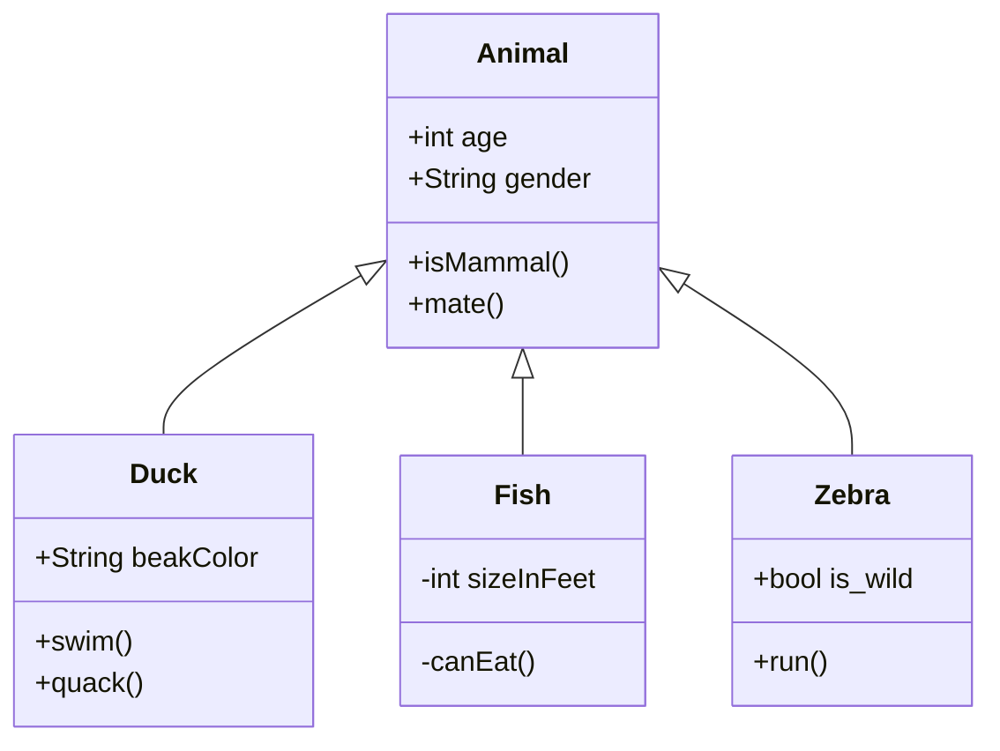
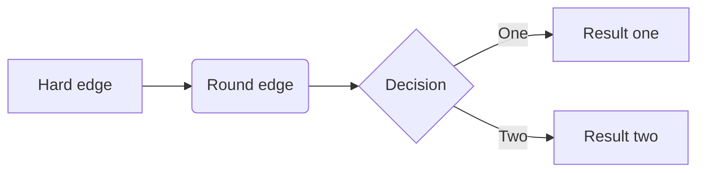

## test

```bash {2}
echo hello
echo suckers
```

Here is a footnote reference,[^1] and another.[^longnote]

[^1]: Here is the footnote.
[^longnote]: Here's one with multiple blocks.

  Subsequent paragraphs are indented to show that they

belong to the previous footnote.

Here is an inline note.^[Inlines notes are easier to write, since
you don't have to pick an identifier and move down to type the
note.]

@flowstart
para=>parallel: parallel tasks
process=>operation: Process
e=>end: End
para(path1, bottom)->process->e
para(path2)->e
@flowend

@startuml
Bob -> Alice : hello
@enduml




